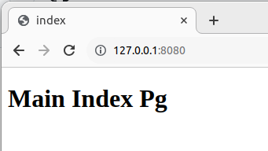
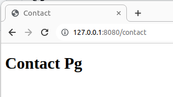
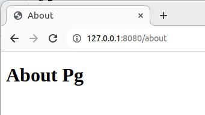
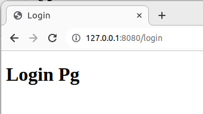

## This basic Golang web dev project doesn't work as intended

-   there are 3 missing HTML files within the templates directory: contact, about, login
-   the code within the main.go file is incomplete
    -   missing function handlers
    -   missing functions
    -   typo

### working code will produce the desired outcome  

-   when `go run main.go` is executed, the  local server will start
-   open your preferred web browser and type in the url bar the following local address and port:  `127.0.0.1:8080`
-   this should be the initial reponse from the browser:

    

-   Screen images for the: contact, about, login

    

    

    

